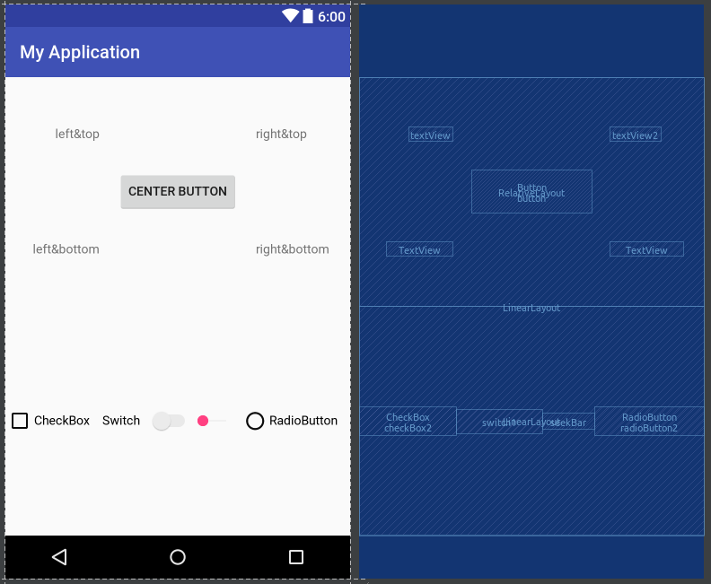

# 阿里巴巴俱乐部Android训练营{Day1}

### 培训内容

- Android环境搭建

> 见`./Android环境配置方案`

- xml初识

1. 一种标记语言，而不是编程语言
2. 便于描述树状数据，由于布局也是树状数据，所以适合用来描述布局
3. 语法是：<标签>文本内容</标签>
4. 在Android中用于编写界面文件、编写样式文件、储存常量数据。

- 编写布局文件

> 见`./activity_main.xml`

